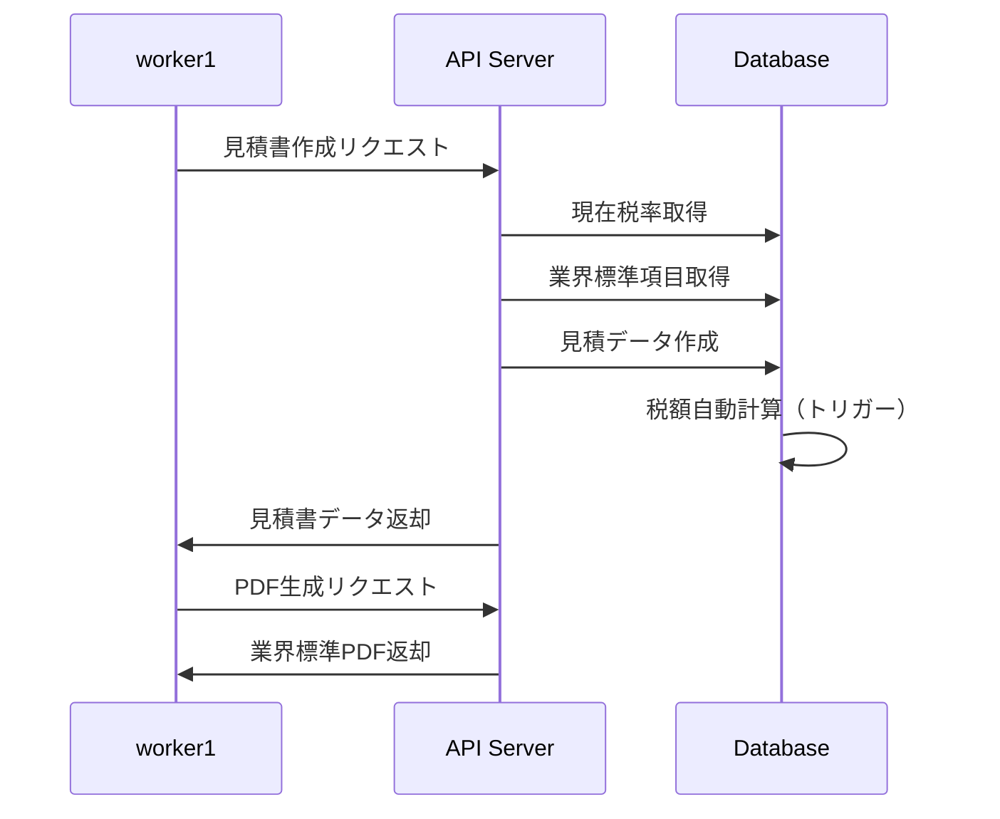
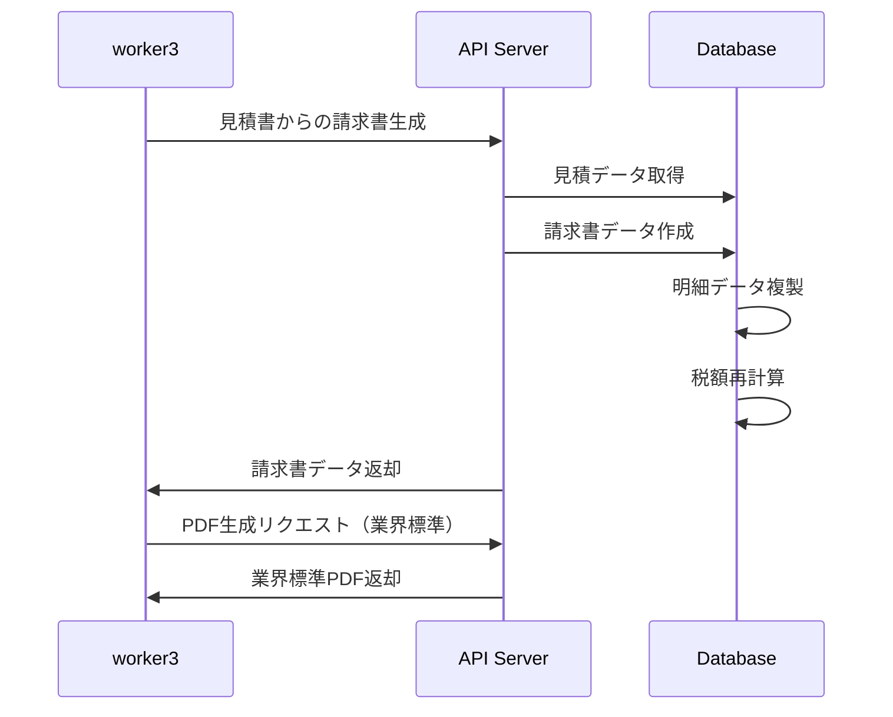

# 🏗️ 造園業界標準対応API拡張仕様書

## 📋 概要

worker1の見積書・worker3の請求書PDF調整に必要なAPI拡張とデータベース連携仕様を定義します。
**造園業界標準フォーマット**に完全対応したAPI設計を提供します。

## 🎯 対応要件

### worker1 見積書PDF調整対応
1. **表紙レイアウト**: ロゴ配置、会社情報、見積番号の標準形式
2. **明細表構成**: 項目順序、単価・数量表示形式
3. **特記事項記載**: 業界慣習に合わせた記載
4. **消費税表示**: 内税・外税表記、軽減税率対応

### worker3 請求書PDF調整対応
1. **請求書レイアウト**: 造園業界慣習対応
2. **消費税表示**: 見積書と連動した税額表示
3. **振込先情報**: 標準的な記載方法
4. **印鑑押印欄**: 配置とサイズ調整

## 🗄️ 新規データベース構造

### 1. 税率管理テーブル（tax_rates）
```sql
CREATE TABLE tax_rates (
    tax_rate_id SERIAL PRIMARY KEY,
    tax_type VARCHAR(20) NOT NULL,           -- 'standard', 'reduced', 'zero', 'exempt'
    tax_rate DECIMAL(5, 4) NOT NULL,         -- 0.1000 (10%)
    effective_from DATE NOT NULL,            -- 適用開始日
    effective_to DATE,                       -- 適用終了日
    description TEXT,                        -- 説明
    is_active BOOLEAN DEFAULT TRUE
);
```

### 2. 業界標準項目マスタ（industry_standard_items）
```sql
CREATE TABLE industry_standard_items (
    standard_item_id SERIAL PRIMARY KEY,
    category_code VARCHAR(10),               -- 'P'(植栽), 'E'(土工事), 'S'(石工事)
    category_name VARCHAR(100),              -- '植栽工事'
    item_code VARCHAR(20),                   -- 'P001'
    item_name VARCHAR(255),                  -- '高木植栽'
    standard_unit VARCHAR(20),               -- '本'
    tax_type VARCHAR(20) DEFAULT 'standard', -- 税種別
    industry_classification VARCHAR(50)      -- 業界分類
);
```

### 3. 拡張された企業情報（companies）
```sql
-- 新規追加フィールド
ALTER TABLE companies ADD COLUMN industry_registration_number VARCHAR(50); -- 造園業登録番号
ALTER TABLE companies ADD COLUMN business_license_number VARCHAR(50);      -- 営業許可番号
ALTER TABLE companies ADD COLUMN tax_registration_number VARCHAR(20);      -- 法人番号
ALTER TABLE companies ADD COLUMN default_tax_handling VARCHAR(20);         -- 'inclusive'/'exclusive'
ALTER TABLE companies ADD COLUMN bank_name VARCHAR(100);                   -- 銀行名
ALTER TABLE companies ADD COLUMN bank_branch VARCHAR(100);                 -- 支店名
ALTER TABLE companies ADD COLUMN bank_account_type VARCHAR(20);            -- 'ordinary'/'current'
ALTER TABLE companies ADD COLUMN bank_account_number VARCHAR(20);          -- 口座番号
ALTER TABLE companies ADD COLUMN bank_account_holder VARCHAR(100);         -- 口座名義
```

### 4. 拡張された見積情報（estimates）
```sql
-- 新規追加フィールド
ALTER TABLE estimates ADD COLUMN estimate_title VARCHAR(255);              -- '造園工事見積書'
ALTER TABLE estimates ADD COLUMN tax_handling VARCHAR(20);                 -- 'inclusive'/'exclusive'
ALTER TABLE estimates ADD COLUMN tax_rounding VARCHAR(20);                 -- 'round'/'floor'/'ceil'
ALTER TABLE estimates ADD COLUMN payment_terms TEXT;                       -- 支払条件
ALTER TABLE estimates ADD COLUMN delivery_terms TEXT;                      -- 納期条件
ALTER TABLE estimates ADD COLUMN warranty_terms TEXT;                      -- 保証条件
ALTER TABLE estimates ADD COLUMN special_notes TEXT;                       -- 特記事項
ALTER TABLE estimates ADD COLUMN construction_period VARCHAR(100);         -- 工事期間
ALTER TABLE estimates ADD COLUMN construction_location TEXT;               -- 施工場所
ALTER TABLE estimates ADD COLUMN estimate_conditions TEXT;                 -- 見積条件
ALTER TABLE estimates ADD COLUMN quote_number_format VARCHAR(50);          -- 見積番号フォーマット
```

### 5. 拡張された請求書情報（invoices）
```sql
-- 新規追加フィールド
ALTER TABLE invoices ADD COLUMN invoice_title VARCHAR(255);                -- '請求書'
ALTER TABLE invoices ADD COLUMN tax_handling VARCHAR(20);                  -- 'inclusive'/'exclusive'
ALTER TABLE invoices ADD COLUMN tax_rounding VARCHAR(20);                  -- 'round'/'floor'/'ceil'
ALTER TABLE invoices ADD COLUMN billing_address TEXT;                      -- 請求先住所
ALTER TABLE invoices ADD COLUMN delivery_address TEXT;                     -- 納品先住所
ALTER TABLE invoices ADD COLUMN construction_completion_date DATE;         -- 工事完了日
ALTER TABLE invoices ADD COLUMN invoice_conditions TEXT;                   -- 請求条件
ALTER TABLE invoices ADD COLUMN payment_deadline_days INTEGER;             -- 支払期限日数
ALTER TABLE invoices ADD COLUMN late_payment_penalty_rate DECIMAL(5, 3);   -- 遅延損害金利率
ALTER TABLE invoices ADD COLUMN invoice_number_format VARCHAR(50);         -- 請求書番号フォーマット
ALTER TABLE invoices ADD COLUMN seal_required BOOLEAN DEFAULT TRUE;        -- 印鑑必要フラグ
ALTER TABLE invoices ADD COLUMN remittance_fee_handling VARCHAR(20);       -- 振込手数料負担
```

### 6. 拡張された見積明細（estimate_items）
```sql
-- 新規追加フィールド
ALTER TABLE estimate_items ADD COLUMN tax_type VARCHAR(20);                -- 'standard'/'reduced'
ALTER TABLE estimate_items ADD COLUMN tax_rate DECIMAL(5, 4);              -- 適用税率
ALTER TABLE estimate_items ADD COLUMN tax_amount DECIMAL(10, 0);           -- 税額
ALTER TABLE estimate_items ADD COLUMN line_total_with_tax DECIMAL(12, 0);  -- 税込金額
ALTER TABLE estimate_items ADD COLUMN industry_standard_item_id INTEGER;   -- 業界標準項目参照
```

## 🔧 API拡張仕様

### 1. 税率管理API

#### 現在有効な税率取得
```http
GET /api/v1/tax-rates/current?tax_type=standard
```
```json
{
  "tax_rate_id": 4,
  "tax_type": "standard",
  "tax_rate": 0.1000,
  "effective_from": "2019-10-01",
  "effective_to": null,
  "description": "消費税10%"
}
```

#### 税率履歴取得
```http
GET /api/v1/tax-rates/history
```
```json
[
  {
    "tax_rate_id": 1,
    "tax_type": "standard",
    "tax_rate": 0.0500,
    "effective_from": "1989-04-01",
    "effective_to": "2014-03-31",
    "description": "消費税5%"
  },
  {
    "tax_rate_id": 4,
    "tax_type": "standard", 
    "tax_rate": 0.1000,
    "effective_from": "2019-10-01",
    "effective_to": null,
    "description": "消費税10%"
  }
]
```

### 2. 業界標準項目API

#### 業界標準項目検索
```http
GET /api/v1/industry-items?category=植栽工事&search=高木
```
```json
[
  {
    "standard_item_id": 1,
    "category_code": "P",
    "category_name": "植栽工事",
    "item_code": "P001",
    "item_name": "高木植栽",
    "standard_unit": "本",
    "tax_type": "standard",
    "industry_classification": "造園工事"
  }
]
```

#### カテゴリ一覧取得
```http
GET /api/v1/industry-items/categories
```
```json
[
  {"code": "P", "name": "植栽工事"},
  {"code": "E", "name": "土工事"},
  {"code": "S", "name": "石工事"},
  {"code": "W", "name": "給排水工事"}
]
```

### 3. 見積書API拡張

#### 見積書作成（業界標準対応）
```http
POST /api/v1/estimates
```
```json
{
  "project_id": 1,
  "estimate_title": "造園工事見積書",
  "tax_handling": "exclusive",
  "tax_rounding": "round",
  "payment_terms": "工事完了後30日以内",
  "delivery_terms": "令和6年3月末日完成予定",
  "warranty_terms": "植栽工事：1年保証",
  "special_notes": "雨天の場合は工期が延びる場合があります。",
  "construction_period": "2025年2月1日～2025年3月31日",
  "construction_location": "東京都新宿区○○町1-2-3",
  "estimate_conditions": "本見積は30日間有効です。",
  "items": [
    {
      "industry_standard_item_id": 1,
      "item_description": "クロマツ H3.0m",
      "quantity": 5,
      "unit": "本",
      "unit_price": 25000,
      "tax_type": "standard"
    },
    {
      "item_description": "土壌改良（特殊土壌対応）",
      "quantity": 10,
      "unit": "m3",
      "unit_price": 8000,
      "tax_type": "standard",
      "is_free_entry": true
    }
  ]
}
```

#### 見積書PDF出力（業界標準フォーマット）
```http
POST /api/v1/estimates/{estimate_id}/pdf/industry-standard
```
```json
{
  "layout_options": {
    "logo_position": "top_left",
    "company_info_position": "top_right", 
    "estimate_number_format": "EST-{YYYY}{MM}{DD}-{###}",
    "page_orientation": "portrait",
    "font_family": "NotoSansCJK",
    "font_size": 10
  },
  "content_options": {
    "show_unit_price": true,
    "show_line_total": true,
    "show_tax_breakdown": true,
    "show_construction_details": true,
    "include_terms_and_conditions": true
  },
  "tax_display": {
    "show_tax_inclusive_total": true,
    "show_tax_exclusive_total": true,
    "show_tax_amount": true,
    "tax_label": "消費税等"
  }
}
```

### 4. 請求書API拡張

#### 請求書作成（見積書からの自動生成）
```http
POST /api/v1/invoices/from-estimate/{estimate_id}
```
```json
{
  "invoice_title": "請求書",
  "billing_address": "東京都新宿区○○町1-2-3\n△△造園株式会社御中",
  "delivery_address": "東京都新宿区○○町1-2-3",
  "construction_completion_date": "2025-03-31",
  "invoice_conditions": "下記の通り請求申し上げます。",
  "payment_deadline_days": 30,
  "seal_required": true,
  "remittance_fee_handling": "customer"
}
```

#### 請求書PDF出力（業界標準フォーマット）
```http
POST /api/v1/invoices/{invoice_id}/pdf/industry-standard
```
```json
{
  "layout_options": {
    "logo_position": "top_left",
    "company_info_position": "top_right",
    "invoice_number_format": "INV-{YYYY}{MM}{DD}-{###}",
    "seal_position": "bottom_right",
    "seal_size": "large"
  },
  "banking_info": {
    "show_bank_details": true,
    "bank_details_position": "bottom_left",
    "remittance_fee_note": "振込手数料はお客様負担でお願いします。"
  },
  "tax_display": {
    "show_tax_calculation": true,
    "tax_breakdown_detail": true,
    "show_payment_deadline": true
  }
}
```

### 5. 税額計算API

#### 税額計算（端数処理対応）
```http
POST /api/v1/calculations/tax
```
```json
{
  "base_amount": 100000,
  "tax_type": "standard",
  "tax_handling": "exclusive",
  "rounding_method": "round"
}
```
Response:
```json
{
  "base_amount": 100000,
  "tax_rate": 0.1000,
  "tax_amount": 10000,
  "total_amount": 110000,
  "calculation_details": {
    "tax_type": "standard",
    "tax_handling": "exclusive",
    "rounding_method": "round",
    "applied_rate": 0.1000
  }
}
```

#### 見積合計再計算
```http
POST /api/v1/estimates/{estimate_id}/recalculate
```
```json
{
  "tax_handling": "exclusive",
  "tax_rounding": "round",
  "final_adjustment": -5000,
  "adjustment_reason": "端数調整"
}
```

## 🎨 PDF生成関数仕様

### 1. 見積書PDF生成関数
```python
async def generate_estimate_pdf_industry_standard(
    estimate_id: int,
    layout_options: dict,
    content_options: dict,
    tax_display: dict
) -> bytes:
    """
    造園業界標準フォーマットの見積書PDF生成
    
    Args:
        estimate_id: 見積ID
        layout_options: レイアウト設定
        content_options: 内容表示設定  
        tax_display: 税額表示設定
        
    Returns:
        PDF バイナリデータ
    """
```

### 2. 請求書PDF生成関数
```python
async def generate_invoice_pdf_industry_standard(
    invoice_id: int,
    layout_options: dict,
    banking_info: dict,
    tax_display: dict
) -> bytes:
    """
    造園業界標準フォーマットの請求書PDF生成
    
    Args:
        invoice_id: 請求書ID
        layout_options: レイアウト設定
        banking_info: 振込先情報設定
        tax_display: 税額表示設定
        
    Returns:
        PDF バイナリデータ
    """
```

## 📊 データ連携フロー

### 1. 見積書作成フロー


### 2. 請求書連携フロー


## 🧪 テスト仕様

### 1. 税額計算テスト
```python
class TestTaxCalculation:
    def test_standard_tax_calculation(self):
        """標準税率での計算テスト"""
        result = calculate_tax_amount(100000, 0.10, 'round')
        assert result == 10000
        
    def test_reduced_tax_calculation(self):
        """軽減税率での計算テスト"""
        result = calculate_tax_amount(100000, 0.08, 'round')
        assert result == 8000
        
    def test_rounding_methods(self):
        """端数処理テスト"""
        base_amount = 333
        tax_rate = 0.10
        
        assert calculate_tax_amount(base_amount, tax_rate, 'round') == 33
        assert calculate_tax_amount(base_amount, tax_rate, 'floor') == 33
        assert calculate_tax_amount(base_amount, tax_rate, 'ceil') == 34
```

### 2. PDF生成テスト
```python
class TestPDFGeneration:
    async def test_estimate_pdf_industry_standard(self):
        """見積書PDF生成テスト"""
        pdf_data = await generate_estimate_pdf_industry_standard(
            estimate_id=1,
            layout_options={"logo_position": "top_left"},
            content_options={"show_tax_breakdown": True},
            tax_display={"show_tax_amount": True}
        )
        
        assert len(pdf_data) > 0
        assert pdf_data.startswith(b'%PDF')
        
    async def test_invoice_pdf_industry_standard(self):
        """請求書PDF生成テスト"""
        pdf_data = await generate_invoice_pdf_industry_standard(
            invoice_id=1,
            layout_options={"seal_position": "bottom_right"},
            banking_info={"show_bank_details": True},
            tax_display={"show_tax_calculation": True}
        )
        
        assert len(pdf_data) > 0
        assert pdf_data.startswith(b'%PDF')
```

## 🚀 実装優先順位

### Phase 1: 緊急対応（即時実装）
1. ✅ データベーススキーマ拡張
2. ✅ 税率管理機能
3. ⏳ API拡張実装
4. ⏳ PDF生成機能拡張

### Phase 2: 統合テスト
1. 見積書↔請求書連携テスト
2. 税額計算精度テスト
3. PDF出力品質テスト
4. パフォーマンステスト

### Phase 3: 最適化
1. 大量データ対応
2. PDF生成速度最適化
3. キャッシュ機能実装

---

**作成日**: 2025-06-30
**対応責任者**: worker5（システム統合・DB担当）
**連携対象**: worker1（見積書）・worker3（請求書）
**品質レベル**: 造園業界標準完全対応