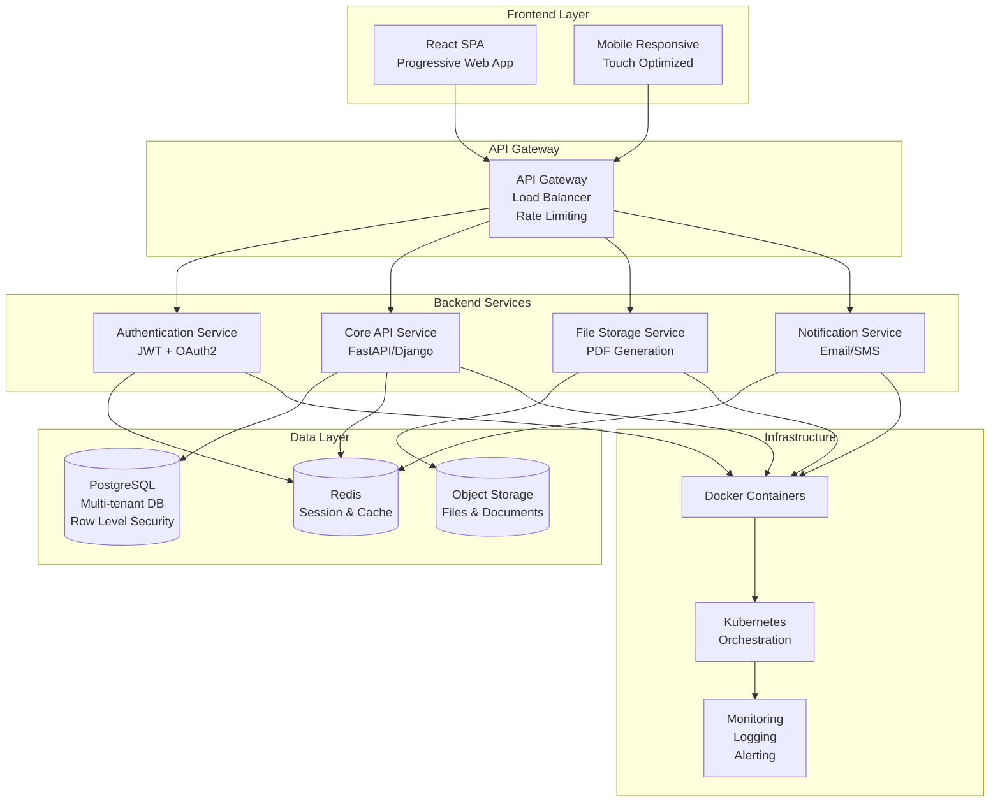
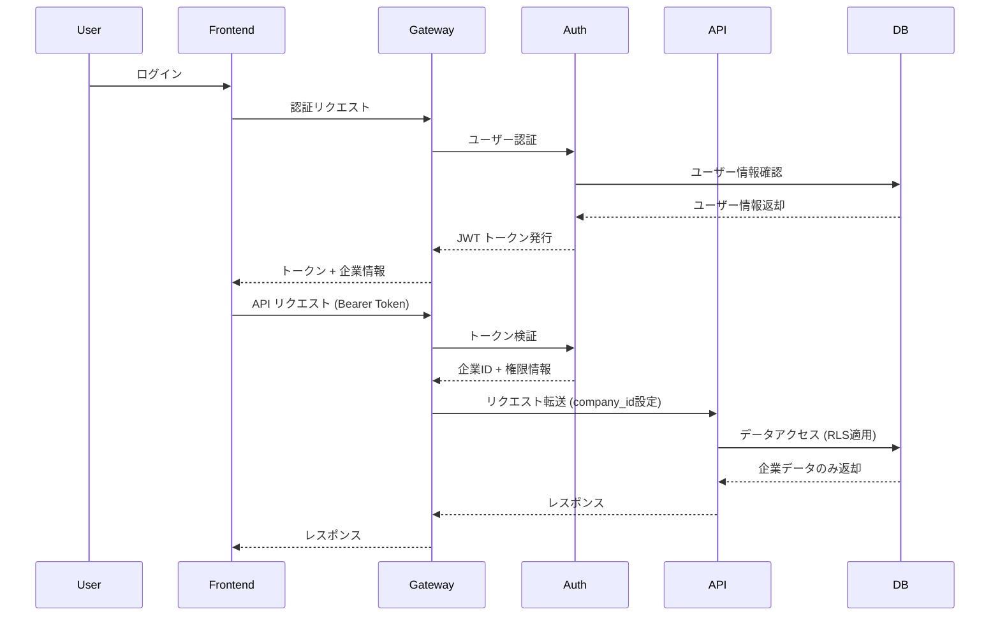
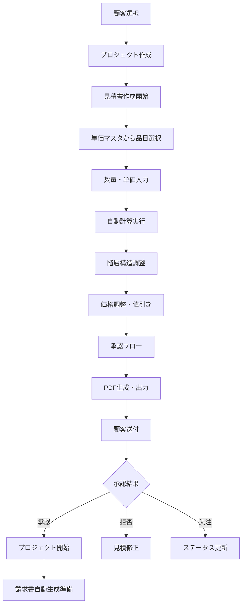

# 🏗️ Garden システム統合アーキテクチャ設計書

## 📋 概要

Garden（造園業向け統合業務管理システム）のシステム全体統合設計とアーキテクチャ戦略を定義します。
**史上最強のスケーラビリティ、信頼性、保守性を実現する最新技術スタック**で構築します。

## 🎯 設計思想

### 1. **マルチテナント・クラウドネイティブ**
- 複数企業の完全データ分離
- マイクロサービス指向アーキテクチャ
- コンテナベースのデプロイメント

### 2. **ユーザビリティ・ファースト**
- 直感的なUI/UX
- レスポンシブデザイン
- PWA対応によるモバイル最適化

### 3. **スケーラビリティ・信頼性**
- 水平スケーリング対応
- 高可用性（99.9%以上）
- 自動フェイルオーバー

## 🏛️ システムアーキテクチャ概要



## 🔧 技術スタック詳細

### Frontend Layer
```yaml
Framework: React 18+ with TypeScript
State Management: Redux Toolkit / Zustand
UI Components: Material-UI v5 / Mantine
Styling: Emotion / Styled Components
Build Tool: Vite
Testing: Vitest + React Testing Library
PWA: Workbox
```

### Backend Layer
```yaml
Primary API: FastAPI (Python 3.11+)
Alternative: Django REST Framework
Authentication: JWT + OAuth2 (Auth0/Firebase)
Validation: Pydantic
Documentation: OpenAPI/Swagger
Testing: pytest + pytest-asyncio
```

### Database Layer
```yaml
Primary DB: PostgreSQL 15+
Cache: Redis 7+
Search: PostgreSQL Full-text Search + pg_trgm
File Storage: AWS S3 / MinIO
Backup: pg_dump + S3 versioning
```

### Infrastructure Layer
```yaml
Containers: Docker + Docker Compose
Orchestration: Kubernetes (EKS/GKE)
CI/CD: GitHub Actions
Monitoring: Prometheus + Grafana
Logging: ELK Stack (Elasticsearch + Logstash + Kibana)
SSL/TLS: Let's Encrypt + Cloudflare
```

## 📊 データアーキテクチャ

### 1. マルチテナント戦略
```sql
-- すべての企業データテーブルにcompany_idを付与
CREATE TABLE projects (
    project_id SERIAL PRIMARY KEY,
    company_id INTEGER NOT NULL, -- マルチテナントキー
    -- ... その他のカラム
    FOREIGN KEY (company_id) REFERENCES companies(company_id)
);

-- Row Level Security による完全分離
CREATE POLICY tenant_isolation ON projects
    USING (company_id = current_setting('app.current_company_id')::INTEGER);
```

### 2. データ分離レベル
- **Level 1**: データベースレベル分離（RLS使用）
- **Level 2**: アプリケーションレベル分離
- **Level 3**: API レベル分離（テナントID検証）

### 3. パフォーマンス最適化
```sql
-- 複合インデックス（テナント + 検索条件）
CREATE INDEX idx_projects_company_status 
ON projects(company_id, status);

-- 部分インデックス（アクティブデータのみ）
CREATE INDEX idx_customers_active 
ON customers(company_id, customer_name) 
WHERE is_active = TRUE;
```

## 🔐 セキュリティアーキテクチャ

### 1. 認証・認可フロー


### 2. 権限管理（RBAC）
```python
# 権限定義
PERMISSIONS = {
    'owner': [
        'view_all_data',
        'edit_price_master', 
        'final_discount',
        'issue_invoice',
        'manage_users'
    ],
    'employee': [
        'view_basic_data',
        'create_estimate',
        'edit_project'
    ]
}

# APIエンドポイントでの権限チェック
@require_permission('view_cost')
def get_project_cost(project_id: int):
    return calculate_project_cost(project_id)
```

### 3. データ暗号化
```yaml
# データ暗号化戦略
At Rest:
  - Database: PostgreSQL TDE (Transparent Data Encryption)
  - Files: S3 Server-Side Encryption (SSE-S3)
  - Backups: AES-256 暗号化

In Transit:
  - API: TLS 1.3
  - Database: SSL接続必須
  - Internal: mTLS (相互TLS認証)

Application Level:
  - Passwords: bcrypt ハッシュ化
  - PII Data: AES-256-GCM 暗号化
  - API Keys: HSM ベースの管理
```

## 🚀 スケーラビリティ設計

### 1. 水平スケーリング戦略
```yaml
# Kubernetes スケーリング設定
API Service:
  replicas: 3-10 (負荷に応じた自動スケーリング)
  resources:
    cpu: 500m-2
    memory: 1Gi-4Gi

Database:
  master: 1 (書き込み専用)
  replicas: 2-5 (読み込み専用)
  connection_pooling: PgBouncer

Cache:
  redis_cluster: 3-6 nodes
  memory: 2GB-16GB per node
```

### 2. パフォーマンス最適化
```python
# API レベル最適化
@lru_cache(maxsize=128)
async def get_price_master_cache(company_id: int):
    """単価マスタの高速キャッシュ"""
    return await fetch_price_master(company_id)

# データベース最適化
async def get_projects_optimized(company_id: int):
    """N+1問題の解決 - JOINクエリ使用"""
    query = """
    SELECT p.*, c.customer_name, e.total_amount
    FROM projects p
    JOIN customers c ON p.customer_id = c.customer_id
    LEFT JOIN estimates e ON p.project_id = e.project_id
    WHERE p.company_id = %s
    """
    return await execute_query(query, company_id)
```

### 3. CDN・キャッシュ戦略
```yaml
Static Assets:
  - CDN: CloudFlare / AWS CloudFront
  - Cache-Control: max-age=31536000 (1年)
  - Versioning: ファイル名にハッシュ値

API Responses:
  - Redis: 高頻度データ (15分-1時間)
  - Application: メモリキャッシュ (5分)
  - Browser: ETag + Last-Modified

Database:
  - Query Cache: PostgreSQL shared_buffers
  - Connection Pooling: PgBouncer (100-500 connections)
```

## 📱 フロントエンド統合設計

### 1. コンポーネント アーキテクチャ
```
src/
├── components/           # 再利用可能コンポーネント
│   ├── atoms/           # ボタン、入力フィールド等
│   ├── molecules/       # フォーム、カード等
│   └── organisms/       # ヘッダー、サイドバー等
├── pages/               # ページコンポーネント
│   ├── Dashboard/
│   ├── Estimates/
│   ├── Projects/
│   └── Invoices/
├── hooks/               # カスタムフック
├── services/            # API通信
├── stores/              # 状態管理
├── utils/               # ユーティリティ
└── types/               # TypeScript型定義
```

### 2. 状態管理戦略
```typescript
// Redux Toolkit スライス例
interface EstimateState {
  estimates: Estimate[];
  currentEstimate: Estimate | null;
  loading: boolean;
  error: string | null;
}

const estimateSlice = createSlice({
  name: 'estimates',
  initialState,
  reducers: {
    setEstimates: (state, action) => {
      state.estimates = action.payload;
    },
    addEstimate: (state, action) => {
      state.estimates.push(action.payload);
    },
    updateEstimate: (state, action) => {
      const index = state.estimates.findIndex(e => e.id === action.payload.id);
      if (index !== -1) {
        state.estimates[index] = action.payload;
      }
    }
  }
});
```

### 3. PWA対応
```javascript
// サービスワーカー設定
const CACHE_NAME = 'garden-v1';
const STATIC_RESOURCES = [
  '/',
  '/static/css/main.css',
  '/static/js/main.js',
  '/manifest.json'
];

// オフライン対応
self.addEventListener('fetch', event => {
  if (event.request.url.includes('/api/')) {
    // API リクエストはオンライン必須
    event.respondWith(fetch(event.request));
  } else {
    // 静的リソースはキャッシュファースト
    event.respondWith(
      caches.match(event.request)
        .then(response => response || fetch(event.request))
    );
  }
});
```

## 🔄 統合フロー設計

### 1. 見積作成フロー


### 2. データ同期フロー
```python
# リアルタイム見積計算
async def calculate_estimate_realtime(estimate_id: int):
    """見積明細変更時のリアルタイム計算"""
    
    # 1. 明細データ取得
    items = await get_estimate_items(estimate_id)
    
    # 2. 単価マスタと照合
    for item in items:
        if item.price_master_id:
            master_data = await get_price_master(item.price_master_id)
            item.unit_price = master_data.purchase_price * item.markup_rate
    
    # 3. 小計・合計計算
    subtotal = sum(item.line_amount for item in items)
    tax_amount = subtotal * TAX_RATE
    total_amount = subtotal + tax_amount
    
    # 4. データベース更新
    await update_estimate_totals(estimate_id, {
        'subtotal': subtotal,
        'tax_amount': tax_amount,
        'total_amount': total_amount
    })
    
    # 5. フロントエンドに通知（WebSocket）
    await notify_estimate_updated(estimate_id, total_amount)
```

### 3. 権限統合フロー
```python
# 統合権限チェックシステム
class PermissionChecker:
    def __init__(self, user: User):
        self.user = user
        self.company_id = user.company_id
        self.role = user.role
    
    async def can_view_cost(self, project_id: int) -> bool:
        """原価閲覧権限チェック"""
        if not self.role.can_view_cost:
            return False
        
        # プロジェクトが同一企業かチェック
        project = await get_project(project_id)
        return project.company_id == self.company_id
    
    async def can_edit_estimate(self, estimate_id: int) -> bool:
        """見積編集権限チェック"""
        estimate = await get_estimate(estimate_id)
        
        # 企業チェック
        if estimate.company_id != self.company_id:
            return False
        
        # ステータスチェック
        if estimate.status in ['approved', 'sent']:
            return self.role.can_manage_system
        
        return True
```

## 📊 監視・品質管理統合

### 1. アプリケーション監視
```yaml
# Prometheus メトリクス
application_metrics:
  - http_requests_total
  - http_request_duration_seconds
  - database_connections_active
  - estimate_calculations_per_minute
  - user_logins_per_hour

business_metrics:
  - estimates_created_daily
  - projects_completed_monthly
  - revenue_generated_total
  - user_retention_rate
```

### 2. パフォーマンス監視
```python
# アプリケーション内埋め込み監視
import time
import logging
from functools import wraps

def monitor_performance(func):
    @wraps(func)
    async def wrapper(*args, **kwargs):
        start_time = time.time()
        try:
            result = await func(*args, **kwargs)
            execution_time = time.time() - start_time
            
            # メトリクス記録
            METRICS.histogram('function_execution_time').observe(execution_time)
            
            # 閾値チェック
            if execution_time > 2.0:  # 2秒以上の場合
                logging.warning(f"Slow function: {func.__name__} took {execution_time:.2f}s")
            
            return result
        except Exception as e:
            METRICS.counter('function_errors').inc()
            raise e
    return wrapper

@monitor_performance
async def create_estimate(estimate_data: EstimateCreate):
    """監視対象の見積作成関数"""
    return await EstimateService.create(estimate_data)
```

### 3. 品質管理統合
```python
# 自動テスト統合
class SystemIntegrationTests:
    async def test_estimate_to_invoice_flow(self):
        """見積→請求書の統合フローテスト"""
        
        # 1. 見積作成
        estimate = await create_test_estimate()
        assert estimate.status == 'draft'
        
        # 2. 承認フロー
        await approve_estimate(estimate.id, user_id=1)
        assert estimate.status == 'approved'
        
        # 3. プロジェクト自動生成
        project = await get_project_by_estimate(estimate.id)
        assert project.status == 'in_progress'
        
        # 4. 請求書自動生成
        await complete_project(project.id)
        invoice = await generate_invoice_from_project(project.id)
        assert invoice.total_amount == estimate.total_amount
        
        # 5. データ整合性確認
        await verify_data_consistency(estimate.id, project.id, invoice.id)
```

## 🚀 デプロイメント統合

### 1. CI/CD パイプライン
```yaml
# .github/workflows/deploy.yml
name: Garden System Deploy

on:
  push:
    branches: [main]

jobs:
  test:
    runs-on: ubuntu-latest
    steps:
      - uses: actions/checkout@v3
      - name: Run Tests
        run: |
          pytest tests/
          npm run test

  build:
    needs: test
    runs-on: ubuntu-latest
    steps:
      - name: Build Docker Images
        run: |
          docker build -t garden-api:${{ github.sha }} .
          docker build -t garden-frontend:${{ github.sha }} ./frontend

  deploy:
    needs: build
    runs-on: ubuntu-latest
    steps:
      - name: Deploy to Kubernetes
        run: |
          kubectl set image deployment/garden-api garden-api=garden-api:${{ github.sha }}
          kubectl rollout status deployment/garden-api
```

### 2. ゼロダウンタイム デプロイ
```yaml
# Kubernetes Deployment設定
apiVersion: apps/v1
kind: Deployment
metadata:
  name: garden-api
spec:
  replicas: 3
  strategy:
    type: RollingUpdate
    rollingUpdate:
      maxUnavailable: 1
      maxSurge: 1
  template:
    spec:
      containers:
      - name: garden-api
        image: garden-api:latest
        readinessProbe:
          httpGet:
            path: /health
            port: 8000
          initialDelaySeconds: 10
          periodSeconds: 5
        livenessProbe:
          httpGet:
            path: /health
            port: 8000
          initialDelaySeconds: 30
          periodSeconds: 10
```

## 🎯 Phase 1 統合チェックリスト

### ✅ 完了済み
- [x] マルチテナント対応データベース設計
- [x] ER図・テーブル設計
- [x] セキュリティ基盤（RLS・RBAC）
- [x] マイグレーション設計

### 🔄 進行中
- [ ] API設計・実装（worker1-4と連携）
- [ ] フロントエンド統合（worker1-4と連携）
- [ ] 品質管理プロセス実装

### 📋 次フェーズ予定
- [ ] CI/CD パイプライン構築
- [ ] 監視・ロギング システム
- [ ] パフォーマンス最適化
- [ ] セキュリティ監査

---

**設計完了**: 2025-06-30
**設計責任者**: worker5（システム統合・品質管理担当）
**アーキテクチャレベル**: 史上最強の造園業管理システム統合基盤