```mermaid
erDiagram
    COMPANIES ||--o{ USERS : "manages"
    COMPANIES ||--o{ CUSTOMERS : "owns"
    COMPANIES ||--o{ PRICE_MASTER : "maintains"
    COMPANIES ||--o{ PROJECTS : "handles"
    
    ROLES ||--o{ USERS : "assigned"
    
    CUSTOMERS ||--o{ PROJECTS : "requests"
    
    PROJECTS ||--o{ ESTIMATES : "generates"
    PROJECTS ||--o{ INVOICES : "results in"
    
    ESTIMATES ||--o{ ESTIMATE_ITEMS : "contains"
    
    PRICE_MASTER ||--o{ ESTIMATE_ITEMS : "references"
    
    USERS ||--o{ PROJECTS : "creates"
    USERS ||--o{ ESTIMATES : "creates"
    USERS ||--o{ ESTIMATES : "approves"
    USERS ||--o{ INVOICES : "creates"
    
    ESTIMATE_ITEMS ||--o{ ESTIMATE_ITEMS : "hierarchical"

    COMPANIES {
        int company_id PK
        string company_name
        string company_code UK
        string subscription_plan
        string subscription_status
        timestamp created_at
        timestamp updated_at
    }
    
    ROLES {
        int role_id PK
        string role_name
        boolean can_view_cost
        boolean can_edit_price_master
        boolean can_final_discount
        boolean can_issue_invoice
        boolean can_manage_system
    }
    
    USERS {
        int user_id PK
        int company_id FK
        int role_id FK
        string username UK
        string email UK
        string password_hash
        string full_name
        boolean is_active
        timestamp last_login_at
        timestamp created_at
        timestamp updated_at
    }
    
    CUSTOMERS {
        int customer_id PK
        int company_id FK
        string customer_code
        string customer_name
        string customer_type
        string address
        string phone
        string email
        boolean is_active
        timestamp created_at
        timestamp updated_at
    }
    
    PRICE_MASTER {
        int item_id PK
        int company_id FK
        string category
        string sub_category
        string item_name
        string item_code
        string unit
        decimal purchase_price
        decimal default_markup_rate
        boolean is_active
        timestamp created_at
        timestamp updated_at
    }
    
    PROJECTS {
        int project_id PK
        int company_id FK
        int customer_id FK
        int created_by FK
        string project_name
        string project_code
        string site_address
        string status
        date start_date
        date end_date
        decimal total_budget
        decimal actual_cost
        timestamp created_at
        timestamp updated_at
    }
    
    ESTIMATES {
        int estimate_id PK
        int company_id FK
        int project_id FK
        int created_by FK
        int approved_by FK
        string estimate_number
        date estimate_date
        date valid_until
        decimal subtotal
        decimal tax_amount
        decimal total_amount
        decimal total_cost
        decimal final_adjustment
        string status
        timestamp approved_at
        timestamp created_at
        timestamp updated_at
    }
    
    ESTIMATE_ITEMS {
        int item_id PK
        int estimate_id FK
        int price_master_item_id FK
        int parent_item_id FK
        int level
        int sort_order
        string item_type
        string item_description
        decimal quantity
        string unit
        decimal purchase_price
        decimal markup_rate
        decimal unit_price
        decimal line_amount
        decimal line_cost
        decimal line_item_adjustment
        boolean is_free_entry
        timestamp created_at
        timestamp updated_at
    }
    
    INVOICES {
        int invoice_id PK
        int company_id FK
        int project_id FK
        int estimate_id FK
        int created_by FK
        string invoice_number
        date invoice_date
        date due_date
        decimal subtotal
        decimal tax_amount
        decimal total_amount
        decimal paid_amount
        string status
        string payment_method
        date payment_date
        timestamp created_at
        timestamp updated_at
    }
```

# Garden システム ER図設計書

## 📊 エンティティ関係図（ER図）概要

## 🔗 主要なリレーションシップ説明

### 1. マルチテナント設計の中核
- **COMPANIES**: システムの最上位エンティティ、全てのビジネスデータの親
- 全ての主要テーブルが `company_id` を持ち、完全なデータ分離を実現

### 2. ユーザー管理・権限制御
- **ROLES**: 経営者/従業員の権限を細かく制御
- **USERS**: 各企業に所属し、役割に基づいた権限を持つ

### 3. 顧客管理
- **CUSTOMERS**: 企業ごとに独立した顧客データベース
- 個人・法人の区別、詳細な連絡先情報を管理

### 4. 単価マスタ（見積の基盤）
- **PRICE_MASTER**: 階層的カテゴリによる品目管理
- 仕入価格と標準掛率による動的価格設定

### 5. プロジェクト管理
- **PROJECTS**: 顧客からの案件を一元管理
- ステータス管理、予算vs実績の追跡

### 6. 見積システム
- **ESTIMATES**: プロジェクトに対する見積書
- **ESTIMATE_ITEMS**: 階層構造対応の見積明細
  - 自己参照外部キー（parent_item_id）による無限階層
  - レベル管理（level）による表示制御
  - ソート順（sort_order）による並び制御

### 7. 請求管理
- **INVOICES**: 完了プロジェクトからの自動請求書生成
- 支払状況の追跡

## 📈 データ整合性保証

### 外部キー制約
- CASCADE: 企業削除時の関連データ一括削除
- RESTRICT: 参照されているデータの削除防止
- SET NULL: 関連データ削除時の参照クリア

### チェック制約
- ステータス値の制限
- 金額データの正数制限
- 日付の論理的整合性

### ユニーク制約
- 企業内でのコード重複防止
- マルチテナント対応の複合ユニーク制約

## 🚀 スケーラビリティ設計

### インデックス戦略
- マルチテナント対応の複合インデックス
- 検索パフォーマンス最適化
- 日付範囲検索の高速化

### Row Level Security (RLS)
- PostgreSQL RLSによる完全なテナント分離
- アプリケーションレベルでの漏洩防止

## 🔒 セキュリティ設計

### アクセス制御
- 役割ベースアクセス制御（RBAC）
- 企業データの完全分離
- 機能レベルの細かな権限制御

### データ保護
- パスワードハッシュ化
- センシティブデータの暗号化対応
- 監査ログ対応

## 💡 Phase 1 実装対象

### 必須テーブル（MVP）
1. ✅ companies（マルチテナント基盤）
2. ✅ roles（権限管理）
3. ✅ users（ユーザー管理）
4. ✅ customers（顧客管理）
5. ✅ price_master（単価マスタ）
6. ✅ projects（案件管理）
7. ✅ estimates（見積管理）
8. ✅ estimate_items（見積明細）
9. ✅ invoices（請求管理）

### Phase 2 拡張予定
- suppliers（仕入先管理）
- purchase_orders（発注管理）
- project_tasks（工程管理）
- project_photos（現場写真）
- change_orders（変更指示）
- audit_logs（監査ログ）

---

**設計完了**: 2025-06-30
**設計者**: worker5（Database Architect）
**品質レベル**: 史上最強の造園業管理システム基盤